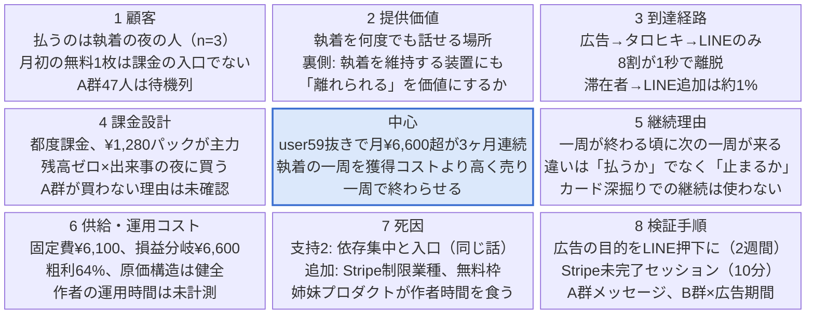

# タロチャ マンダラチャート＆打ち手リスト（2026-09-28）

2026-09-28 · satie

正本（編集用）: https://claude.ai/code/artifact/0888866c-69ea-400e-b795-33a161f9fac1

## 中心テーマと今日の結論

**中心: user59抜きで、月¥6,600（損益分岐）を超える課金が3ヶ月連続で続いている状態。** 人数にすると月4〜5人。9月は user59 抜きで ¥7,680 と初めて損益分岐を超えたが n=2 で、再現できて初めて成立とみなす。

成長方針は脱依存。戦略の軸は一文で「執着の一周を、獲得コストより高く売り、一周で終わらせる」。3つの掛け算が黒字になれば成立し、連れてくる人数は結果であって目標ではない。

| 変数 | 現在値 | 根拠 |
| --- | --- | --- |
| 友だち追加1人の単価 | 約¥700 | 9/22〜28 広告費¥2,866 ÷ 登録4人 |
| 追加→279型（健全な課金者）になる率 | 約2% | 占い到達109人中2人（user279・388） |
| 279型の一周の売上 | ¥7,680 | user279 の7/17〜9/18、6回課金（n=1） |

今の値では 50人×¥700＝¥35,000 かけて ¥7,680 の回収で赤字。3変数のどれかを動かす。一番安く動かせるのは単価、一番大きく動かせるのは279型率、一番危ないのは一周の単価（依存との境目を踏む）。

## マンダラチャート 8本柱

柱1・2は今日の対話で埋めた。柱3〜8はClaudeのドラフトで、次回の壁打ちで詰める。タグは ✅確認済み / 🔶仮説 / ⬜空白。user59型は意図的に顧客定義から外す。

各マスは柱の要点3行と状態タグの集計。詳細は下の各柱の表。

### 柱1 顧客 — 誰が、どの瞬間に困っているか

| # | マス | タグ |
| --- | --- | --- |
| 1 | user279型: ¥1,280パックを繰り返し買い、1日5回で止まる。7月から3ヶ月継続 | ✅（n=1） |
| 2 | user388型: 9月初課金、1ヶ月で3回課金。279型に育つかは未知 | ✅（n=1） |
| 3 | A群47人: 無料3枚を使い切り、毎月1日に無料1枚を取りに戻り、残高ゼロで叩く。価格を見ても買わない | ✅ |
| 4 | 月初の無料1枚は来訪維持であって課金の入口ではない。課金46回中0回 | ✅ |
| 5 | 困る瞬間その1＝執着してる相手に何か起きた夜。課金の61%、22時〜3時 | ✅（n=3、うち59が37回） |
| 6 | 困る瞬間その2＝前回出たカードの意味をもっと知りたい。39%、出来事なしで深夜に続く | ✅（ほぼuser59） |
| 7 | 3人とも相談相手は特定の一人（ツインの彼・不倫相手・元カノ）。恋愛、執着の対象がいる | ✅（n=3） |
| 8 | 属性＝学生・若年層でカード未保有 / 流入元＝Instagram広告 | 🔶 |

届けたい「自己発見の余白」層と、払っている層は別人。払っているのは「答えを待てない夜の人」（🔶→ほぼ✅）。

### 柱2 提供価値 — 代替手段に対する差分

| # | マス | タグ |
| --- | --- | --- |
| 1 | 「解決しない共感」。答えを出さず気持ちを受け止める | 🔶（gpt-4.1で回っているが比較テスト無し） |
| 2 | 深夜に起きている。22〜3時に、人に言えない相談を聞く相手がいない | 🔶 |
| 3 | カードという第三者。「カードがそう言った」と言える。執着から離れる補助線になりうる | 🔶 |
| 4 | 執着の対象について何度でも話せる場所。友達には同じ話を何度もできない | ✅（3人の相談内容） |
| 5 | 裏側: 何度でも聞く＝執着を維持する装置にもなる。user59の深掘り16回 | ✅ |
| 6 | 「気持ちが整理されて離れられる」を価値として掲げるか。user279の離脱は成果 | ⬜（プロジェクト全体の分岐） |
| 7 | 無料AI占い（ChatGPT直打ち、他LINE占いボット）に対して¥480払う理由 | ⬜ |
| 8 | 月初の無料1枚の価値＝定期的な気持ちの確認。A群47人はこれで満足。有料の価値と別物 | ✅ |

### 柱3 到達経路 — 欲求が発生した瞬間・場所でどう出会うか（ドラフト）

| # | マス | タグ |
| --- | --- | --- |
| 1 | 入口はInstagram広告→タロヒキ（one.tarocha.jp）→LINE追加。新規はほぼ広告経由 | ✅ |
| 2 | 広告: 7,900ビュー→1,934アクセス、CPC¥1.5、CTR24%。A/B/Cタップ誘導のクリエイティブ | ✅ |
| 3 | タロヒキ: Paid Socialの平均エンゲージメント1秒、エンゲージセッション0.21。8割が見ずに離脱 | ✅（GA4） |
| 4 | タロヒキ→LINE: 約380人の滞在者から登録4人（約1%）。導線はフッターのみ | ✅ |
| 5 | 広告以外の入口（検索、SNS、相互紹介）はほぼゼロ | ✅ |
| 6 | 執着の夜に出会う経路（深夜配信、悩み系ターゲット）は効くが依存と衝突 | 🔶（打ち手7・9） |
| 7 | 9/26の広告が¥44しか消化していない理由（審査落ち？） | ⬜ |
| 8 | 1秒離脱が「興味なし」か「読み込み待ち」か | ⬜（PageSpeed未確認） |

### 柱4 課金設計 — 誰がいつ何に払うか（ドラフト）

| # | マス | タグ |
| --- | --- | --- |
| 1 | 都度課金。単価¥398〜480、¥1,280の3回パックが主力 | ✅ |
| 2 | 支払者＝利用者。決済はStripeのクレカのみ | ✅ |
| 3 | 課金確認ダイアログなし。課金トラブル0件（カード限定の副産物かもしれない） | ✅（条件付き） |
| 4 | 課金の瞬間＝残高ゼロ×出来事の夜。パックをその夜に使い切る | ✅（n=3） |
| 5 | A群47人が¥480を何度も見て買わない理由（価格 / 決済手段 / 主義） | ⬜（Stripe未完了セッション未確認） |
| 6 | 決済手段を広げると未成年課金トラブルの死因が開く | 🔶 |
| 7 | 後から納得できる課金明細と月間上限の有無 | ⬜ |
| 8 | Stripeの制限業種（占い）に該当するか | ⬜ |

### 柱5 継続理由 — 2回目に戻ってくる構造（ドラフト）

| # | マス | タグ |
| --- | --- | --- |
| 1 | 一度払った人は再課金する（6人中4人） | ✅（n=6） |
| 2 | 健全な継続＝「一周が終わる頃に次の一周（次の執着）が来る」。同じ人の連続課金ではない | 🔶 |
| 3 | 月初の無料1枚＝一周の空白期間にLINEに残しておく装置。A群47人は待機列 | 🔶 |
| 4 | user279は執着が解けて離脱しそう（9/20「どうでも良くなってきた」）。次の相手で戻るか | ⬜ |
| 5 | 「前回のカードの続き」で戻る構造はuser59型の継続。使わない | ✅（決定） |
| 6 | 279型と59型の違いは「払うか」ではなく「止まるか」（5回/日 vs 18回/日） | ✅ |
| 7 | LINE以外に戻ってこられる接点 | ⬜（ゼロ） |
| 8 | タロヒキから戻る導線（結果直後の受け渡し） | ⬜（未実装） |

### 柱6 供給・運用コスト（ドラフト）

| # | マス | タグ |
| --- | --- | --- |
| 1 | 固定費 月約¥6,100（LINE¥5,000、Google Cloud約¥1,100）。損益分岐 月¥6,600 | ✅ |
| 2 | 比例費 LLM¥13.5/回ニStripe3.6%。粗利は単価の64% | ✅ |
| 3 | 広告費 2週間で約¥3,000。原価には含めない方針 | ✅ |
| 4 | サポート負荷はuser59に集中（連打・コンテキスト混入のエッジケース） | ✅ |
| 5 | 作者の週あたり運用時間、直近リリース間隔 | ⬜ |
| 6 | Google Cloud ¥37/日のSKU内訳 | ⬜ |
| 7 | 姉妹プッシュ型プロダクトが作者時間を食うリスク | 🔶 |
| 8 | gpt-4.1の廃止予定なし。代替モデルの質感テストは未実施だが優先度低 | ✅/🔶 |

### 柱7 死因 — プレモータムの結果

| # | 死因 | 判定 | 緊急度 |
| --- | --- | --- | --- |
| 1 | 依存ユーザーで売上が成立（累計82%がuser59、2月11回→7月60回） | 支持 | 高 |
| 2 | 入口が広告しかなく、その広告が意図の合わないタップを買っている | 支持 | 高 |
| 3 | 作者が飽きた／回らない | 判断不能 | 高 |
| 4 | 無料AI占いに単価を削られた（A群47人が買わない理由次第） | 判断不能 | 中 |
| 5 | LINE改定・停止。LINE外の連絡手段ゼロ | 判断不能 | 中 |
| 6 | Stripeが占いを制限業種として止める | 判断不能 | 中 |
| 7 | 無料の月初1枚／タロヒキが有料を食う | 🔶 | 中 |
| 8 | 決済手段を広げたら未成年の課金トラブルが出る | 🔶（条件付き） | 低→中 |
| 9 | TTSがキャラの正体になり、音声モデル変更で離脱 | 🔶 | 低 |
| 10 | モデル終了で質感が消える | 弱い否定 | 低 |
| 11 | 課金確認なしのトラブル | 否定（カード限定の間） | 低 |
| 12 | 景表法・特商法（表現の棚卸し未実施） | 判断不能 | 低 |

死因1と2は同じ話（入口が細く、入った人の中から一人だけが大量に払っている）。こだわっているが死因と無関係: 「カードが覚えている」機構（n=1のための汎用機構）、旧GPT質感への不安（4.1で解消済み）、課金確認ダイアログの有無。

### 柱8 検証手順 — 何を最小で確かめれば勝てると言えるか（ドラフト）

| # | 検証 | 確かめる仮説 | 最小の方法 |
| --- | --- | --- | --- |
| 1 | 広告の目的をLINE押下に変えて2週間 | 単価¥700→¥300以下にできる | GA4/Metaイベント3つ＋新キャンペーン |
| 2 | Stripe未完了セッション数 | A群が買わないのは決済手段 | Stripeダッシュボード、10分 |
| 3 | A群47人の残高ゼロ時メッセージを読む | 価格か決済手段か主義か | DB抽出、1時間 |
| 4 | B群32人の登録日×広告期間 | Bは失望ではなく広告の残骸 | DB、10分 |
| 5 | タロヒキのPageSpeed | 1秒離脱は読み込み待ち | PageSpeed Insights、1分 |
| 6 | 9/26広告の不消化理由 | Meta審査で占いが弾かれる | 広告マネージャ確認 |
| 7 | 新規のうち1日10回超の人数を週次で見る | 施策が59型を増やしていない | DB、週次 |
| 8 | user279の10月の動き | 一周が終わると去る／次の一周で戻る | DB、月次 |

## ③健全な成長の条件の現状

6条件中2つ達成。本来④は開かないが、今回の一手は集客の加速ではなく配管工事（入る人数を増やさず、質と計測を直す）なので条件付きで開いた。止める条件は週次で見張り続ける。

| 条件 | 状態 |
| --- | --- |
| 上位5%シェア30%未満、または依存対策が本番稼働 | 未達（user59を顧客定義から外したが、対策は動いていない） |
| 代替モデルの質感テスト完了 | 未達（優先度は下げた） |
| 1占い粗利が単価の50%超 | 達（64%） |
| 2回目課金率15%超 | 達（67%、n=6） |
| 納得できる課金明細と月間上限 | 未確認 |
| LINE外の連絡接点 | 未達 |

止める条件（どれか1つで集客を止めて先に直す）: 1日10回超のユーザーが新規の1%超 / 返金・苦情が月3件以上 / ブロック率30%超 / 粗利が単価の20%割れ。

## 打ち手10個と評価

一番弱い段は「広告→タロヒキ→LINE」。効果・軽さは5点満点。7・9・10は自分では思いつかない系統として入れたが、7と9は「執着している人を効率よく集める」で、効く理由がそのまま危ない理由。

| # | 打ち手 | 効果 | 軽さ | 死因チェック |
| --- | --- | --- | --- | --- |
| 1 | GA4とMetaに「シャッフル」「めくり」「LINE押下」イベントを入れる | 3 | 5 | なし |
| 2 | 広告の目的をトラフィック→コンバージョン（LINE押下）に変える | 4 | 5 | なし |
| 3 | クリエイティブをA/B/Cタップ誘導から「質問を書いて1枚引く」の正直版に | 4 | 4 | なし。CTRは落ちる |
| 4 | タロヒキの結果直後にLINE導線、引いたカードと質問をタロチャに引き継ぐ | 4 | 2 | なし。1回目の質が上がる |
| 5 | PageSpeedで初回表示を測る。重ければ軽くする | 2 | 5 | なし |
| 6 | タロヒキの鑑定を「カードの意味」で切り、「あなたの状況で」をタロチャへ | 3 | 3 | タロヒキ単体の価値を削る。#8と相性が悪い |
| 7 | 深夜22〜3時だけ広告配信。課金が起きる時間帯に絞る | 3 | 5 | 注意。深夜利用は依存の兆候。59型を呼ぶ率も上がる |
| 8 | 78枚のカード意味ページをタロヒキに置いて検索流入を作る | 4 | 1 | なし。効くまで3ヶ月以上 |
| 9 | ターゲットを「タロット占い」から「復縁・ツインレイ・片想い」の悩み系に寄せる | 4 | 4 | 危険。59型をピンポイントで集める。Meta審査も怪しい |
| 10 | タロヒキの結果を画像で保存・ストーリーズ共有できるようにする | 3 | 3 | なし。LINEに来る率は不明 |

## 2週間でやる1つ: #1＋#2「広告の最適化先をLINE押下にする」

1. タロヒキにイベント3つ（shuffle / reveal / line\_click）を実装し、GA4とMetaピクセル両方に送る。半日
2. Metaで line\_click をカスタムコンバージョンに登録。30分
3. 今の広告が終わったら、コンバージョン目的の新キャンペーンを同じクリエイティブ・同じ予算で出す。1時間
4. 2週間走らせて、ファネルを5段（ビュー→アクセス→めくり→LINE押下→登録）で出す

成功の数字: アクセス→LINE登録が1%→3%以上 / 登録1人の単価が¥700→¥300以下 / 登録→占い到達が50%を維持。失敗なら（単価が¥700から動かない）原因は目的ではなくクリエイティブなので #3 に進む。見張るもの: 新規のうち1日10回超の人数、0を維持。

### Now / Next / Later

| 時期 | 項目 | 状態 |
| --- | --- | --- |
| Now（〜10/12） | #1＋#2 計測と広告の目的変更 | 未着手 |
| Now | #5 PageSpeed確認（30分） | 未着手 |
| Now | B群32人の登録日を広告期間と重ねる（DB、10分） | 未着手 |
| Now | Stripe未完了セッションの確認（10分） | 未着手 |
| Next（10〜11月） | #4 結果直後の受け渡し。カードと質問を持ってLINEへ | 未着手 |
| Next | #3 正直版クリエイティブ（#2の結果次第） | 未着手 |
| Next | 決済手段の追加（Stripeの結果次第）。追加するなら未成年トラブルの死因を先に条件化 | Stripe確認待ち |
| Next | user59への個別方針を決める | 未着手 |
| Next | A群47人の残高ゼロメッセージを読む | 未着手 |
| Later（12月〜） | #8 78枚のカードページ（SEO） | 方向のみ |
| Later | 回数券・一周パッケージの価格設計。依存との境目を先に条件化 | 方向のみ |
| Later | LINE外の接点（タロヒキがその候補） | 方向のみ |
| Later | 代替モデルの質感テスト | 方向のみ |

### やらないこと

- 「このカードをもっと深く見る」導線（user59の深掘り16回を仕組みにするもの）
- 月額パス
- \#9 恋愛執着ターゲティング。効くのは分かっているが、脱依存を選んだ時点で外す
- 姉妹プッシュ型プロダクトへの着手（作者時間の共食い）
- 「カードが覚えている」機構の実装（n=1のために作らない）

### 反論

「目的変更しても、この予算では2週間で何も分からない」。予算は2週間で約¥3,000。コンバージョン目的でCPCが¥50になれば60クリック、1割がLINEに来ても6人で、今の4人と区別がつかない。答えは2つで、予算を一時的に¥10,000/2週間に上げて桁を知るか、6週間走らせるか。どちらも「¥30,000使って入口の実力を知る」と割り切る話。予算の判断は未決。

## 決まったことのログ

| 日付 | ステップ | 決まったこと |
| --- | --- | --- |
| 2026-09-28 | ④ 打ち手 | 2週間の一手は「広告の目的変更とタロヒキの計測」。やらないこと5つを明記。予算（¥3,000か¥10,000か）は未決 |
| 2026-09-28 | ③ 条件 | 6条件中2つ達成。配管工事に限って④を条件付きで開いた。中心テーマは「user59抜きで月¥6,600超が3ヶ月連続」 |
| 2026-09-28 | 顧客の検証 | 課金46回中、月初は0回。61%が出来事の夜、39%が前回カードの深掘り（ほぼuser59）。3人とも執着の対象が特定の一人 |
| 2026-09-28 | 入口の検証 | 9/22〜28 広告¥2,866で登録4人（うち2人は同一人物の可能性）。Paid Socialの平均エンゲージメント1秒。穴は広告→タロヒキが8割、タロヒキ→LINEが1% |
| 2026-09-28 | ② プレモータム | 支持2つ（依存集中・入口）は同じ死因。user59は顧客定義から外す。追加死因: Stripe制限業種、無料枠が有料を食う、姉妹プロダクトが作者時間を食う。9月はuser59抜きで初めて損益分岐超え |
| 2026-09-28 | 方針 | 脱依存。再現性があればuser59以外にも課金はある、を前提に組む |
| 2026-09-28 | ① 健康診断 | 売上変動はuser59の変動。4〜6月はuser59以外の売上ゼロ。7月から他ユーザーの線が3ヶ月連続で存在（¥3,840→¥3,040→¥7,680） |

次回の持ち込み: Now の4項目の結果（ファネル5段の数字、PageSpeed、B群×広告期間、Stripe未完了）。数字が揃ったら①をやり直す。
